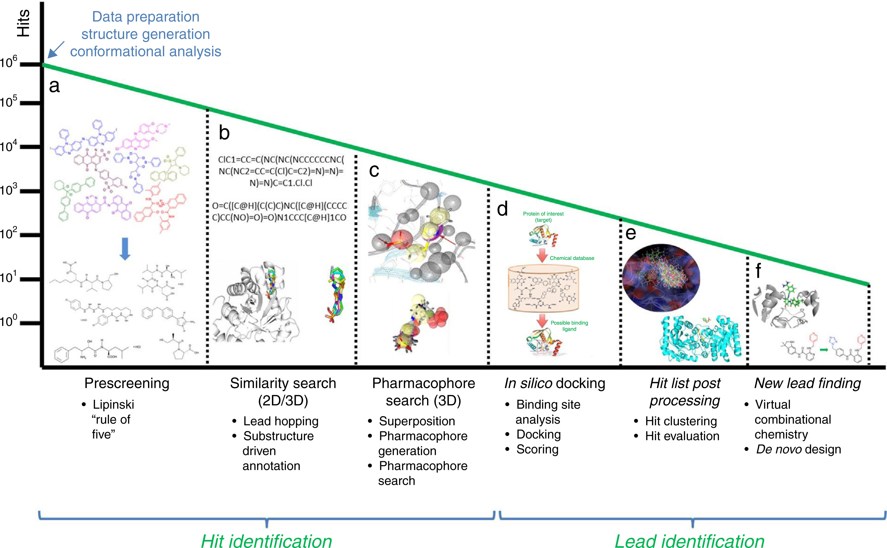

Developing a novel drug is a complex, risky, expensive and time-consuming venture. It is estimated that the conventional
drug discovery process ending with a new medicine ready for the market can take up to 15 years and more than a billion
USD. Fortunately, this scenario has recently changed with the arrival of new approaches. Many novel technologies and
methodologies have been developed to increase the efficiency of the drug discovery process, and computational
methodologies have become a crucial component of many drug discovery programs. From hit identification to lead
optimization, techniques such as ligand- or structure-based virtual screening are widely used in many discovery efforts.
It is the case for designing potential anticancer drugs and drug candidates, where these computational approaches have
had a major impact over the years and have provided fruitful insights into the field of cancer. In this paper, we review
the concept of rational design presenting some of the most representative examples of molecules identified by means of
it. Key principles are illustrated through case studies including specifically successful achievements in the field of
anticancer drug design to demonstrate that research advances, with the aid of in silico drug design, have the potential
to create novel anticancer drugs.

Workflow for hit identification: from data preparation to finding new leads.

