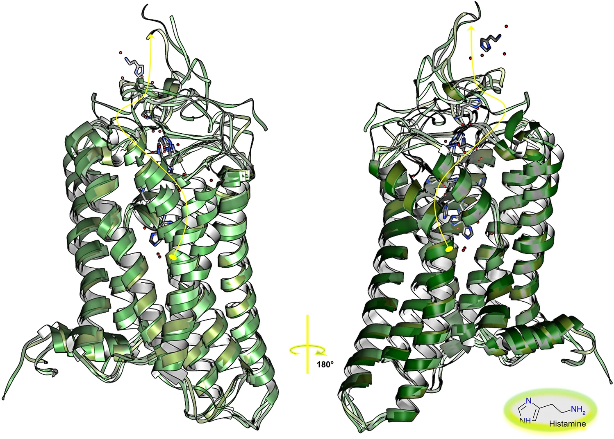

In this work, we studied the mechanisms of classical activation and inactivation of signal transduction by the histamine
H3 receptor, a 7-helix transmembrane bundle G-Protein Coupled Receptor through long-time-scale atomistic molecular
dynamics simulations of the receptor embedded in a hydrated double layer of dipalmitoyl phosphatidyl choline, a
zwitterionic polysaturated ordered lipid. Three systems were prepared: the apo receptor, representing the constitutively
active receptor; and two holo-receptors—the receptor coupled to the antagonist/inverse agonist ciproxifan, representing
the inactive state of the receptor, and the receptor coupled to the endogenous agonist histamine and representing the
active state of the receptor. An extensive analysis of the simulation showed that the three states of H3R present
significant structural and dynamical differences as well as a complex behavior given that the measured properties
interact in multiple and interdependent ways. In addition, the simulations described an unexpected escape of histamine
from the orthosteric binding site, in agreement with the experimental modest affinities and rapid off-rates of agonists.

Histamine unbinding pathway. Schematic illustration of the four phases of the spontaneous unbinding and exit pathway of
the HSM ligand (curve in yellow), showing the pathway from its lodging in the binding cavity (section 1), with
interactions of either the imidazol or the amino group with TM2, TM3, ECL2, TM6 and TM7; to its disposal from it
(section 2) with interactions with N-ter, TM3, ECL2, TM6 and TM7; to its small residence time in the vestibular area
formed by N-ter, TM3, ECL2 and TM7 (section 3); and to its final escape into the solvent (section 4). Several of the
previous interactions are mediated by water.

