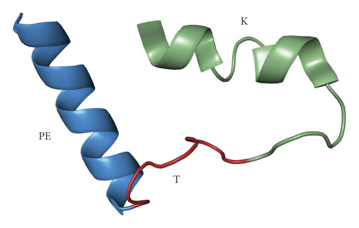

Hematologic malignancies such as leukemias and lymphomas are among the leading causes of pediatric cancer death
worldwide, and although survival rates have improved with conventional treatments, the development of drug-resistant
cancer cells may lead to patient relapse and limited possibilities of a cure. Drug-resistant cancer cells in these
hematologic neoplasms are induced by overexpression of the antiapoptotic B-cell lymphoma 2 (Bcl-2) protein families,
such as Bcl-XL, Bcl-2, and Mcl-1. We have previously shown that peptides from the BH3 domain of the proapoptotic Bax
protein that also belongs to the Bcl-2 family may antagonize the antiapoptotic activity of the Bcl-2 family proteins,
restore apoptosis, and induce chemosensitization of tumor cells. Furthermore, cell-permeable Bax BH3 peptides also
elicit antitumor activity and extend survival in a murine xenograft model of human B non-Hodgkin’s lymphoma. However,
the activity of the BH3 peptides of the proapoptotic Bak protein of the Bcl-2 family against these hematologic malignant
cells requires further characterization. In this study, we report the ability of the cell-permeable Bak BH3 peptide to
restore apoptosis and induce chemosensitization of acute lymphoblastic leukemia and non-Hodgkin’s lymphoma cell lines,
and this event is enhanced with the coadministration of cell-permeable Bax BH3 peptide and represents an attractive
approach to improve the patient outcomes with relapsed or refractory hematological malignant cells.

3D structure of cell-permeable Bak BH3 peptide (PETK) and expression of the Bcl-2 family proteins in hematologic malignant cells.

