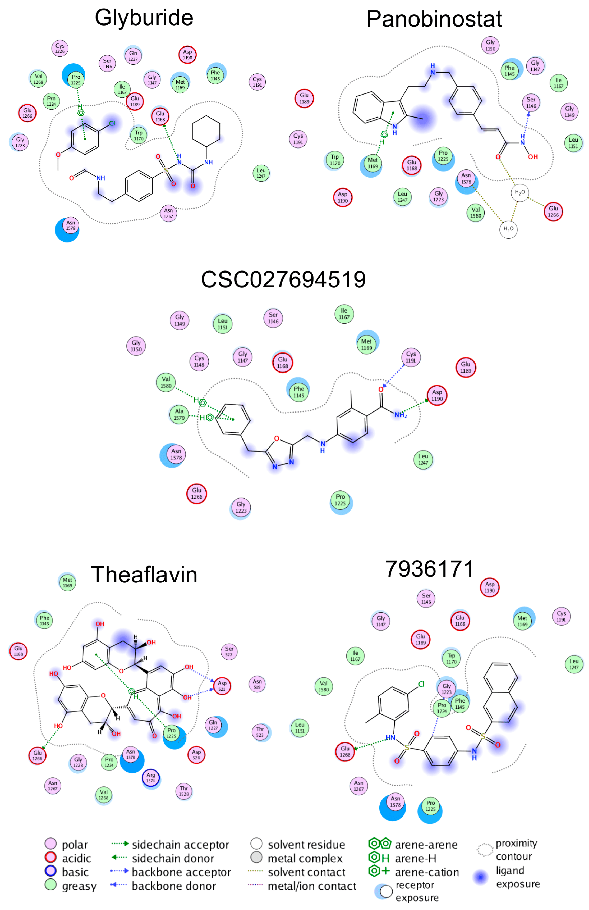

Inhibitors of DNA methyltransferases (DNMTs) are attractive compounds for epigenetic drug discovery. They are also
chemical tools to understand the biochemistry of epigenetic processes. Herein, we report five distinct inhibitors of
DNMT1 characterized in enzymatic inhibition assays that did not show activity with DNMT3B. It was concluded that the
dietary component theaflavin is an inhibitor of DNMT1. Two additional novel inhibitors of DNMT1 are the approved drugs
glyburide and panobinostat. The DNMT1 enzymatic inhibitory activity of panobinostat, a known pan inhibitor of histone
deacetylases, agrees with experimental reports of its ability to reduce DNMT1 activity in liver cancer cell lines.
Molecular docking of the active compounds with DNMT1, and re-scoring with the recently developed extended connectivity
interaction features approach, led to an excellent agreement between the experimental IC50 values and docking scores.

Binding poses predicted with the Molecular with Molecular Operating Environment v.2018 of
the five active compounds with the catalytic domain of DNA methyltransferase 1.

