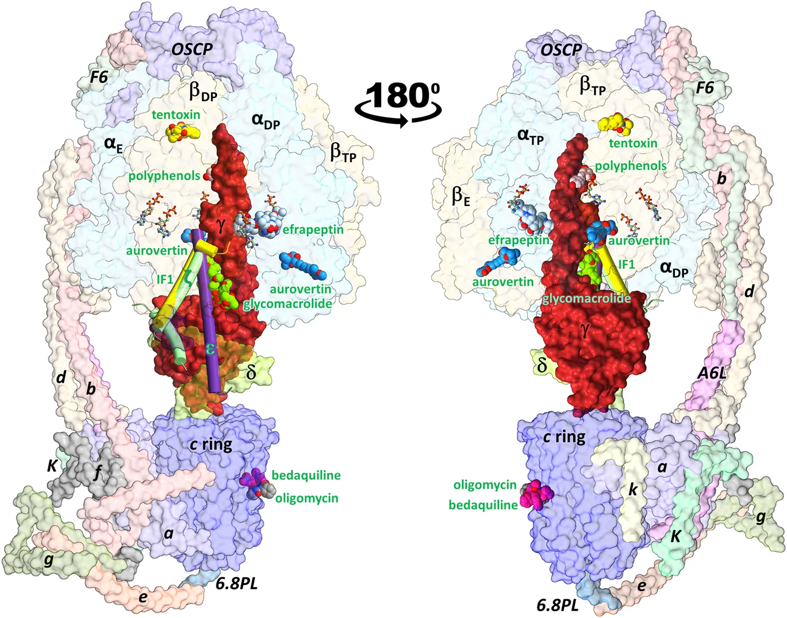

In addition to playing a central role in the mitochondria as the main producer of ATP, FOF1-ATP synthase performs
diverse key regulatory functions in the cell membrane. Its malfunction has been linked to a growing number of human
diseases, including hypertension, atherosclerosis, cancer, and some neurodegenerative, autoimmune, and aging diseases.
Furthermore, inhibition of this enzyme jeopardizes the survival of several bacterial pathogens of public health concern.
Therefore, FOF1-ATP synthase has emerged as a novel drug target both to treat human diseases and to combat antibiotic
resistance. In this work, we carried out a computational characterization of the binding sites of the fungal antibiotic
aurovertin in the bovine F1 subcomplex, which shares a large identity with the human enzyme. Molecular dynamics
simulations showed that although the binding sites can be described as preformed, the inhibitor hinders inter-subunit
communications and exerts long-range effects on the dynamics of the catalytic site residues. End-point binding free
energy calculations revealed hot spot residues for aurovertin recognition. These residues were also relevant to
stabilize solvent sites determined from mixed-solvent molecular dynamics, which mimic the interaction between aurovertin
and the enzyme, and could be used as pharmacophore constraints in virtual screening campaigns. To explore the
possibility of finding species-specific inhibitors targeting the aurovertin binding site, we performed free energy
calculations for two bacterial enzymes with experimentally solved 3D structures. Finally, an analysis of bacterial
sequences was carried out to determine conservation of the aurovertin binding site. Taken together, our results
constitute a first step in paving the way for structure-based development of new allosteric drugs targeting FOF1-ATP
synthase sites of exogenous inhibitors.

Schematic representation of the ATP synthase architecture and the binding sites of
exogenous and endogenous allosteric inhibitors.

