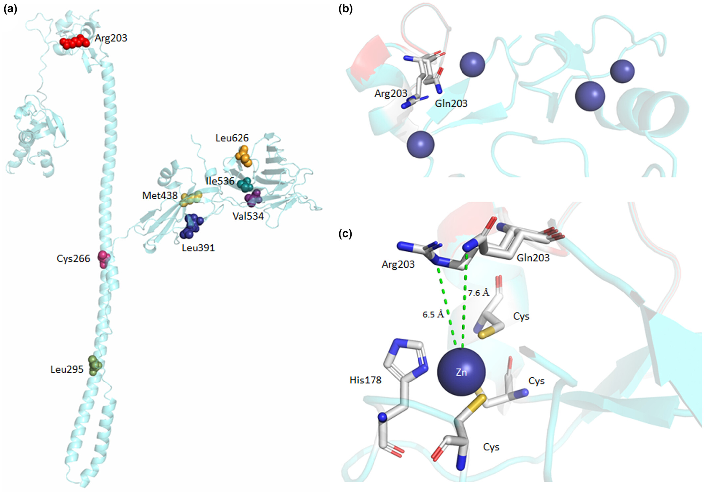

Opitz GBBB syndrome (GBBB) is an X-linked disease characterized by midline defects, including congenital heart defects.
We present our diagnostic approach to the identification of GBBB in a consanguineous family in which two males siblings
were concordant for a total anomalous connection of pulmonary veins and minor facial dysmorphias.

The three-dimensional structure of E3 ubiquitin-protein ligase Midline-1, as determined
by molecular modeling and the spatial locations of surface mutations.

