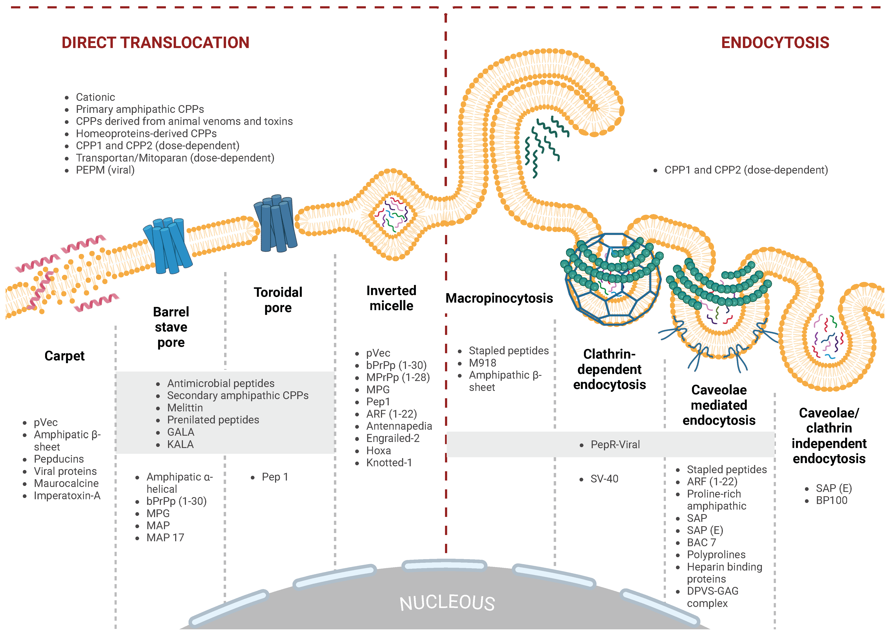

Cell-penetrating peptides (CPPs) are a diverse group of peptides, typically composed of 4 to 40 amino acids, known for
their unique ability to transport a wide range of substances—such as small molecules, plasmid DNA, small interfering
RNA, proteins, viruses, and nanoparticles—across cellular membranes while preserving the integrity of the cargo. CPPs
exhibit passive and non-selective behavior, often requiring functionalization or chemical modification to enhance their
specificity and efficacy. The precise mechanisms governing the cellular uptake of CPPs remain ambiguous; however,
electrostatic interactions between positively charged amino acids and negatively charged glycosaminoglycans on the
membrane, particularly heparan sulfate proteoglycans, are considered the initial crucial step for CPP uptake. Clinical
trials have highlighted the potential of CPPs in diagnosing and treating various diseases, including cancer, central
nervous system disorders, eye disorders, and diabetes. This review provides a comprehensive overview of CPP
classifications, potential applications, transduction mechanisms, and the most relevant algorithms to improve the
accuracy and reliability of predictions in CPP development.

Intracellular entry pathways for CPPs. CPPs utilize two primary mechanisms for cellular
entry: energy-dependent endocytosis and energy-independent direct translocation across the lipid bilayer.

