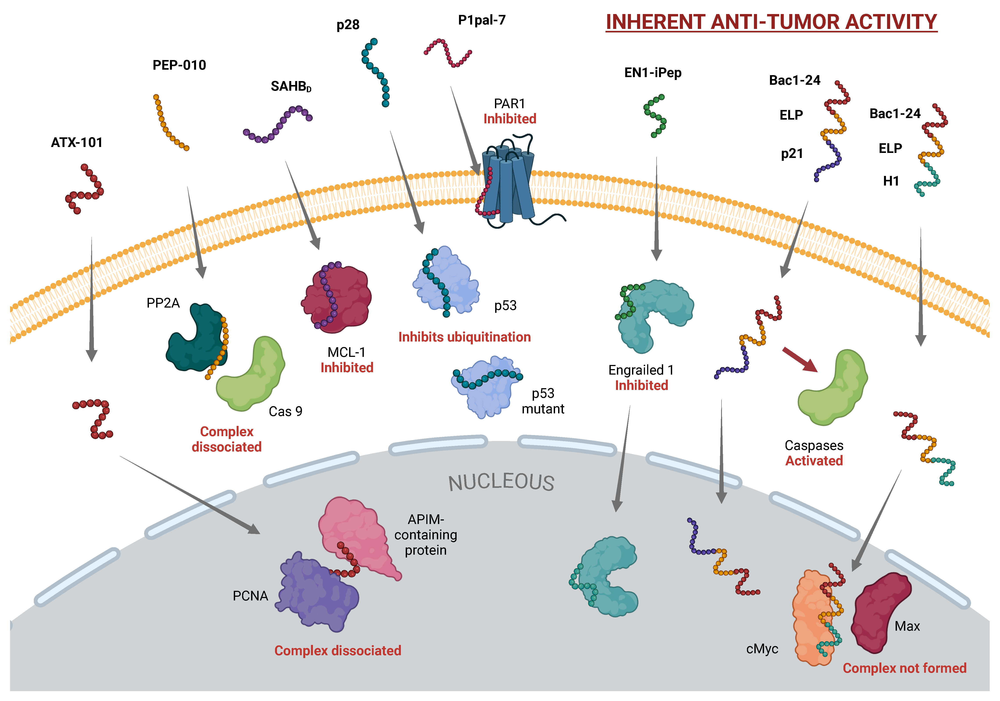

Cell-penetrating peptides (CPPs) offer a unique and efficient mechanism for delivering therapeutic agents directly into
cancer cells. These peptides can traverse cellular membranes, overcoming one of the critical barriers in drug delivery
systems. In this review, we explore recent advancements in the application of CPPs for cancer treatment, focusing on
mechanisms, delivery strategies, and clinical potential. The review highlights the use of CPP-drug conjugates, CPP-based
vaccines, and their role in targeting and inhibiting tumor growth.

CPPs with Intrinsic Anticancer Activity. This figure presents CPPs that exert therapeutic
effects through intrinsic biological functions, independent of cargo.

